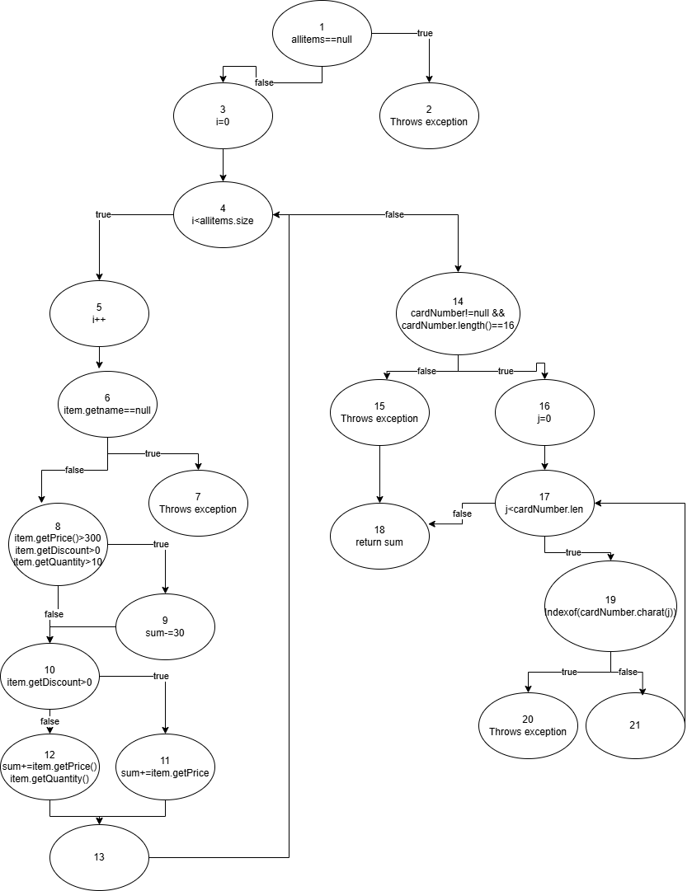

# SI_2025_lab2_213093
Dimitar Velkov 213093
1.=======

=======
Dimitar Velkov 213093 CFG Diagram

2. Сложеноста беше пресметана со броење на точките за одлучување:
- 1 за if (allItems == null)
- 1 за for јамката
- 1 за if (item.getName() == null || item.getName().length() == 0)
- 1 за if (item.getPrice() > 300 || item.getDiscount() > 0 || item.getQuantity() > 10)
- 1 за if (item.getDiscount() > 0)`
- 1 за if (cardNumber != null && cardNumber.length() == 16)
- 1 за if (allowed.indexOf(c) == -1) во рамките на for јамката

Ова резултира со 6(точки за одлучување)+1(влезна точка)=7.
>>>>>>> 5c6e626 (Step 1)
